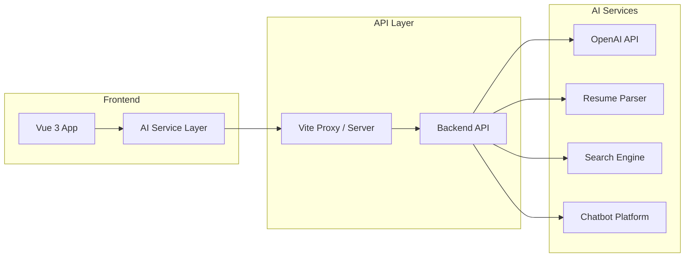

# AI Integration Proposal for Job Board Platform

## Executive Summary

This document outlines comprehensive AI integration opportunities for your job board platform. Based on the current Vue 3 architecture with Pinia state management and Vue Router, there are numerous high-impact AI features that can significantly enhance user experience and platform value.

---

## AI Integration Opportunities

### 1. **AI-Powered Job Search & Matching** 🔍

**Description:** Intelligent job recommendations based on candidate profiles, search history, and behavior patterns.

**Implementation Options:**

| Feature | Description | Complexity |
|---------|-------------|------------|
| Semantic Search | Use NLP to understand job descriptions and candidate intent beyond keywords | Medium |
| Job Matching | AI algorithms to match candidates with relevant jobs automatically | Medium |
| Personalized Recommendations | "Jobs you might like" section based on profile and history | Low |
| Smart Filters | Auto-suggest filters based on search patterns | Low |

**Technical Approach:**
- Integrate with APIs like Elasticsearch with ML plugins
- Use vector embeddings for semantic similarity (Pinecone, Weaviate)
- Or use LLM APIs (OpenAI, Anthropic) for intelligent search enhancement

---

### 2. **Resume & Profile Enhancement** 📄

**Description:** AI tools to help candidates improve their profiles and resumes.

**Implementation Options:**

| Feature | Description | Complexity |
|---------|-------------|------------|
| Resume Parser | Automatically extract and structure information from uploaded resumes | Medium |
| Profile Suggestions | AI recommendations to complete/enhance candidate profiles | Low |
| Skills Gap Analysis | Compare candidate skills with job requirements | Medium |
| Resume Scoring | Rate resume completeness and quality | Low |

**Technical Approach:**
- Use document parsing APIs (Amazon Textract, Google Document AI)
- LLM-based analysis for suggestions and scoring

---

### 3. **Chatbot & Virtual Assistant** 💬

**Description:** AI-powered chatbot for candidate and employer support.

**Implementation Options:**

| Feature | Description | Complexity |
|---------|-------------|------------|
| Job Search Assistant | Help users find jobs through conversational interface | Medium |
| Application Support | Guide candidates through application process | Medium |
| Employer Support | Help employers post jobs and manage listings | Medium |
| FAQ Automation | Answer common questions automatically | Low |

**Technical Approach:**
- Dialogflow CX or similar conversational AI platforms
- Custom chatbot with LLM integration (RAG pattern)
- Integration with existing support systems

---

### 4. **Content Generation** ✍️

**Description:** AI-assisted content creation for job postings and descriptions.

**Implementation Options:**

| Feature | Description | Complexity |
|---------|-------------|------------|
| Job Description Generator | AI generates job descriptions from basic inputs | Low |
| Company Description Writer | Help employers write compelling company profiles | Low |
| Email Templates | Auto-generate application follow-up emails | Low |
| Content Optimization | Improve job posting visibility and effectiveness | Medium |

**Technical Approach:**
- OpenAI GPT API or Anthropic Claude API
- Custom prompts optimized for job board domain

---

### 5. **Candidate Screening & Assessment** 🎯

**Description:** AI-powered screening tools for employers.

**Implementation Options:**

| Feature | Description | Complexity |
|---------|-------------|------------|
| Resume Ranking | Score and rank candidates based on job requirements | Medium |
| Keyword Matching | Advanced matching beyond simple keyword search | Low |
| Predictive Analytics | Predict candidate success probability | High |
| Skills Assessment | AI-powered technical skill evaluation | High |

**Technical Approach:**
- Custom ML models trained on successful hires
- Integration with assessment platforms

---

### 6. **Fraud Detection & Security** 🛡️

**Description:** AI-powered security and fraud prevention.

**Implementation Options:**

| Feature | Description | Complexity |
|---------|-------------|------------|
| Fake Job Detection | Identify and flag suspicious job postings | Medium |
| Spam Prevention | Detect and filter spam applications | Low |
| Profile Verification | Verify candidate identity and credentials | Medium |
| Anomaly Detection | Identify unusual patterns in user behavior | Medium |

**Technical Approach:**
- ML classifiers for content moderation
- User behavior analytics

---

### 7. **Analytics & Insights** 📊

**Description:** AI-powered analytics and predictions.

**Implementation Options:**

| Feature | Description | Complexity |
|---------|-------------|------------|
| Market Trends | Analyze job market trends and salary insights | Medium |
| Hiring Analytics | Dashboard with AI-generated insights | Medium |
| Demand Forecasting | Predict job demand by category/location | High |
| Performance Predictions | Predict job listing success | Medium |

**Technical Approach:**
- Data analytics with ML models
- Business intelligence dashboards

---

## Recommended Priority Implementation

Based on impact and feasibility, here's my recommended order:

### Phase 1 (Quick Wins - 1-2 weeks)
1. **Job Description Generator** - Low complexity, high value for employers
2. **Smart Search Filters** - Improve existing search experience
3. **FAQ Chatbot** - Reduce support burden

### Phase 2 (High Impact - 2-4 weeks)
4. **AI Resume Parser** - Streamline application process
5. **Job Matching Engine** - Core differentiator feature
6. **Candidate Recommendations** - Increase engagement

### Phase 3 (Advanced - 4-8 weeks)
7. **Conversational Job Search** - Transform user experience
8. **Fraud Detection** - Platform security
9. **Analytics Dashboard** - Business insights

---

## Technical Implementation Options

### Option A: LLM-Based (OpenAI/Anthropic)
- **Pros:** Most capable, easy to implement, flexible
- **Cons:** API costs, dependency on external service
- **Best for:** Content generation, chatbot, analysis

### Option B: Self-Hosted ML Models
- **Pros:** Full control, no external dependencies, customizable
- **Cons:** Requires ML expertise, infrastructure costs
- **Best for:** High-volume features, data privacy

### Option C: Specialized APIs (Third-party)
- **Pros:** Pre-built solutions, fast implementation
- **Cons:** Less customization, vendor lock-in
- **Best for:** Resume parsing, search, verification

---

## Integration Architecture



---

## Next Steps

1. **Define Budget:** Determine investment level for AI integration
2. **Select Priority Features:** Choose 2-3 features from Phase 1
3. **Choose Technology:** Decide on implementation approach (LLM vs APIs vs custom)
4. **Prototype:** Build MVP for selected feature
5. **Iterate:** Expand based on user feedback

---

## Questions for You

To provide more specific recommendations, please consider:

1. **What's your budget range?** (Free/trial, $100-500/month, $500+/month)
2. **What's your technical capacity?** (Frontend only, have backend, have ML expertise)
3. **What's your primary goal?** (User engagement, employer value, operational efficiency)
4. **Any specific AI vendors preferred?** (OpenAI, Google, AWS, etc.)

This will help me tailor the recommendations to your specific situation and resources.

---

## Detailed Implementation Plan: Content Generation AI

### Feature: AI-Powered Job Description Generator

**Target Component:** [`PostDetails.vue`](src/components/jobPostComponents/PostDetails.vue)

**Overview:** Add an "AI Generate" button that uses OpenAI GPT to auto-generate job descriptions, responsibilities, requirements, and benefits based on basic inputs like job title, category, and experience level.

### Implementation Steps

#### Step 1: Create AI Service

Create a new composable to handle AI API calls:

```javascript
// src/composables/useAI.js
import { ref } from 'vue'
import axios from 'axios'

export function useAI() {
  const loading = ref(false)
  const error = ref(null)

  const generateJobContent = async (jobData) => {
    loading.value = true
    error.value = null

    const prompt = `
      Generate a professional job posting with the following details:
      - Job Title: ${jobData.title}
      - Category: ${jobData.category}
      - Experience Level: ${jobData.experienceLevel}
      - Work Type: ${jobData.workType}
      
      Provide a JSON response with:
      1. description: 2-3 paragraph job description
      - responsibilities: Array of 5-6 key responsibilities
      - requirements: Array of 5-6 key requirements
      - benefits: Array of 4-5 benefits/perks
    `

    try {
      const response = await axios.post(
        'https://api.openai.com/v1/chat/completions',
        {
          model: 'gpt-3.5-turbo',
          messages: [{ role: 'user', content: prompt }],
          temperature: 0.7
        },
        {
          headers: {
            'Authorization': `Bearer ${import.meta.env.VITE_OPENAI_API_KEY}`,
            'Content-Type': 'application/json'
          }
        }
      )

      return JSON.parse(response.data.choices[0].message.content)
    } catch (e) {
      error.value = e.message
      throw e
    } finally {
      loading.value = false
    }
  }

  return { loading, error, generateJobContent }
}
```

#### Step 2: Create AI Generation Button Component

Create a reusable button component that can be added to the PostDetails form:

```vue
<!-- src/components/ai/AIGenerateButton.vue -->
<script setup>
import { ref } from 'vue'
import { useAI } from '@/composables/useAI'

const props = defineProps({
  jobData: Object,
  fieldType: {
    type: String,
    required: true,
    validator: (value) => ['description', 'responsibilities', 'requirements', 'benefits'].includes(value)
  }
})

const emit = defineEmits(['generated'])

const { loading, error, generateJobContent } = useAI()

const handleGenerate = async () => {
  try {
    const result = await generateJobContent(props.jobData)
    emit('generated', result)
  } catch (e) {
    console.error('AI generation failed:', e)
  }
}
</script>

<template>
  <button 
    type="button"
    :disabled="loading"
    @click="handleGenerate"
    class="px-3 py-1 text-sm bg-gradient-to-r from-purple-500 to-indigo-500 text-white rounded-md hover:from-purple-600 hover:to-indigo-600 disabled:opacity-50 flex items-center gap-1"
  >
    <span v-if="loading">Generating...</span>
    <span v-else>✨ AI Generate</span>
  </button>
</template>
```

#### Step 3: Integrate into PostDetails Component

Add the AI generation buttons to the existing form fields:

```vue
<!-- Add to PostDetails.vue -->
<script setup>
import { useAI } from '@/composables/useAI'

const { generateJobContent } = useAI()

const handleAIGenerate = async () => {
  const result = await generateJobContent({
    title: props.modelValue.title,
    category: props.modelValue.category,
    experienceLevel: props.modelValue.experienceLevel,
    workType: props.modelValue.workType
  })
  
  // Update form with AI-generated content
  emit('update:modelValue', {
    ...props.modelValue,
    description: result.description,
    responsibilities: result.responsibilities,
    requirements: result.requirements,
    benefits: result.benefits
  })
}
</script>

<template>
  <!-- Add generate button to each field -->
  <div class="flex justify-between items-center">
    <label>Job Description *</label>
    <AIGenerateButton 
      :job-data="modelValue" 
      field-type="description"
      @generated="(data) => modelValue.description = data.description"
    />
  </div>
</template>
```

### API Configuration

Add environment variables to `.env`:

```env
VITE_OPENAI_API_KEY=your_openai_api_key_here
```

### Project Files to Modify

| File | Action |
|------|--------|
| `src/composables/useAI.js` | Create new AI composable |
| `src/components/ai/AIGenerateButton.vue` | Create new button component |
| `src/components/jobPostComponents/PostDetails.vue` | Add AI buttons to form |
| `.env` | Add API keys |

### Estimated Implementation Time

- **Difficulty:** Low to Medium
- **Time:** 2-4 hours for MVP
- **Cost:** $0-50/month (based on API usage)